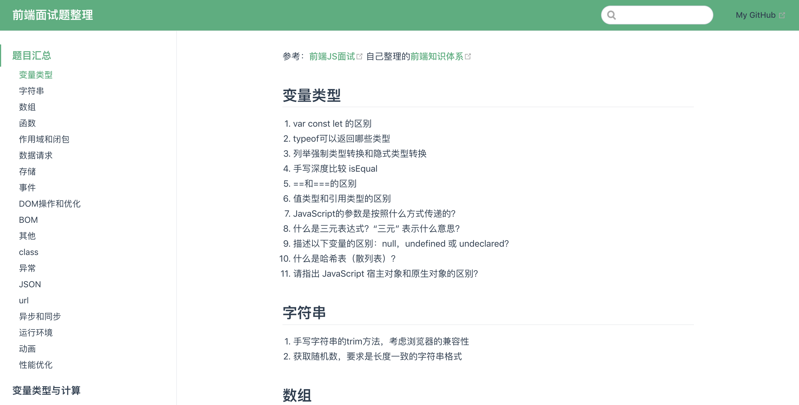

# 前端面试题整理

参考：[前端JS面试](https://coding.imooc.com/learn/list/115.html)

自己整理的[前端知识体系](https://www.processon.com/view/link/5e358818e4b05b335ff8d4eb)

使用vuepress搭建

## Project setup
- npm install
- npm run docs:dev

